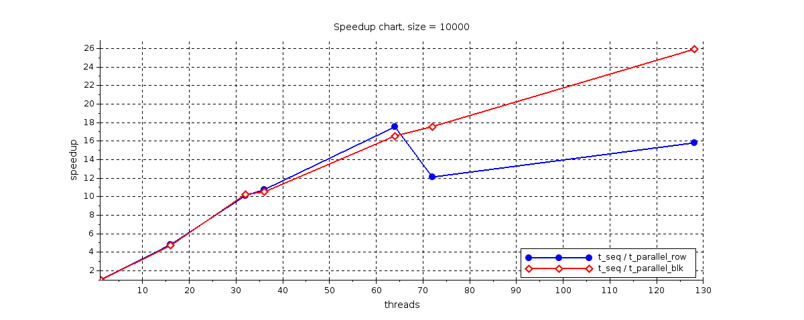
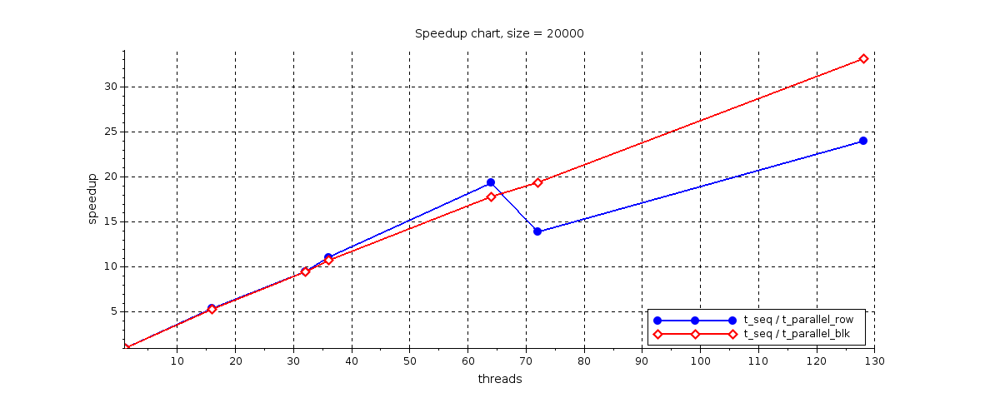
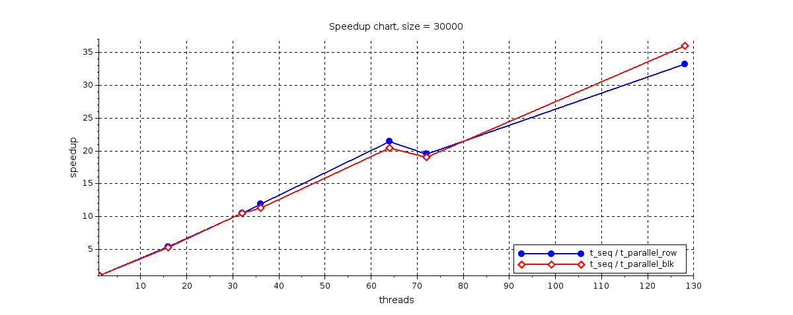
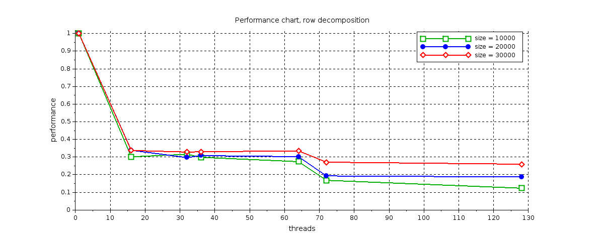
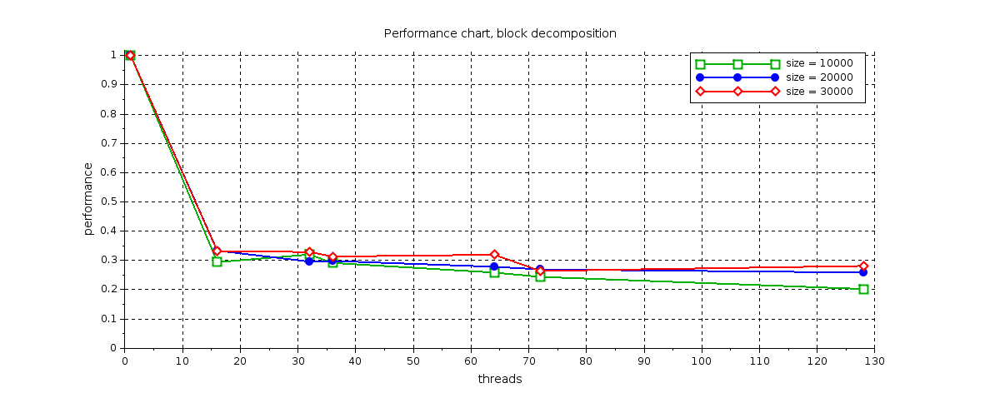

# Conway's Game of Life
This is an implementation of [Life](https://en.wikipedia.org/wiki/Conway%27s_Game_of_Life) for scalability testing using __MPI + OpemMP__. The implementation is optimized to some extent in terms of computational cost but not memory cost. Three implementations which are tested are __sequential__ version of the algorithm, __parallel 1D decomposition__ (row decomposition) and parallel __2D decomposition__ (block decomposition).

MPI is used here for parallelization based on non-shared memory (multiple servers) and OpenMP for shared memory (cores on the same server). Both approaches are used simultaneously here. The tests were run through SLURM on a cluster with output presented below. Unfortunately I don't know the cluster specification. Decomposition explanation can be found in literature \[1] as well as scalability analysis \[2]. The board is square.

### Test results
Tested configurations: \[10000, 20000, 30000] board edge size (*n*) / \[4, 9, 16] *processes* / \[4, 8] *threads*.

More charts can be found in the *chart* directory.

### Bibliography

\[1] William Gropp, Rusty Lusk, Rob Ross, Rajeev Thakur, Advanced MPI: I/O and One-Sided Communication, “IEEE Supercomputing” 2005,
http://www.mcs.anl.gov/research/projects/mpi/tutorial/advmpi/sc2005-advmpi.pdf.

\[2] Distributed Stencil Computations: Conway’s Game of Life, Umea University, Sweden, https://www8.cs.umu.se/kurser/5DV050/VT12/gol.pdf.

### License

Copyright (c) 2018 Damian Terlecki

Permission is hereby granted, free of charge, to any person obtaining a copy
of this software and associated documentation files (the "Software"), to deal
in the Software without restriction, including without limitation the rights
to use, copy, modify, merge, publish, distribute, sublicense, and/or sell
copies of the Software, and to permit persons to whom the Software is
furnished to do so, subject to the following conditions:

The above copyright notice and this permission notice shall be included in all
copies or substantial portions of the Software.

THE SOFTWARE IS PROVIDED "AS IS", WITHOUT WARRANTY OF ANY KIND, EXPRESS OR
IMPLIED, INCLUDING BUT NOT LIMITED TO THE WARRANTIES OF MERCHANTABILITY,
FITNESS FOR A PARTICULAR PURPOSE AND NONINFRINGEMENT. IN NO EVENT SHALL THE
AUTHORS OR COPYRIGHT HOLDERS BE LIABLE FOR ANY CLAIM, DAMAGES OR OTHER
LIABILITY, WHETHER IN AN ACTION OF CONTRACT, TORT OR OTHERWISE, ARISING FROM,
OUT OF OR IN CONNECTION WITH THE SOFTWARE OR THE USE OR OTHER DEALINGS IN THE
SOFTWARE.